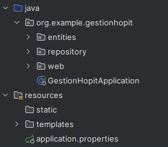

# Application Web JEE pour la gestion des patients d'un hopital (Spring MVC, Thymeleaf) 

---
## Structure du projet
Le projet étant une application web suivant le design pattern MVC (Model View Controller), doit suivre une structure déterminée:

Notre projet doit avoir : 
- un répertoire contenant les entités (Model)
- un répertoire contenant les controlleurs (Controller)
- un répertoire contenant les vues (View)

Notre projet :



---
## Création des entités
### L'entité Patient
L'entité ```Patient``` possède 5 attributs :
```Java
@Entity
@Data @NoArgsConstructor @AllArgsConstructor @Builder
public class Patient {
    @Id @GeneratedValue(strategy = GenerationType.IDENTITY)
    private Long id;
    private String username;
    private Date dateOfBirth;
    private boolean isSick;
    private int score;
}
```
- **id:** l'identifiant d'un patient
- **username:** le nom d'utilisateur d'un patient
- **dateOfBirth:** date de naissance d'un patient
- **isSick:** un booléen représentant si un patient est malade / non malade
- **score:** le score d'un patient

### Annotations
Pour les annotations :
- **@Entity:** permet de lier entre la classe et l'entité Patient dans la base de données
- **@Data:** annotation ```lombok``` pour génerer les Getters et les Setters de la classe
- **@NoArgsConstructor:** annotation pour génerer un constructeur sans paramètres pour la classe
- **@AllArgsConstructor:** annotation pour génerer un constructeur avec les paramètres pour la classe
- **@Builder:** annotation pour appliquer le design pattern Builder à la classe
- **@Id:** annotation pour définir l'identifiant de la classe
- **@GeneratedValue:** annotation pour choisir l'algorithme de génération des identifiants pour les classes
---
## Liaison entre l'Application et la base de données
Après avoir lancé une instance MySQL, on ouvre le fichier ```application.properties```:
```properties
spring.application.name=GestionHopit
server.port=8084
#spring.datasource.url=jdbc:h2:mem:patients-db
#spring.h2.console.enabled=true
spring.datasource.url=jdbc:mysql://localhost:3306/hospital?createDatabaseIfNotExist=true
spring.datasource.username=root
spring.datasource.password=****
spring.jpa.hibernate.ddl-auto=update
spring.jpa.properties.hibernate.dialect=org.hibernate.dialect.MariaDBDialect
```

---
## Configuration des Controlleurs
Pour ajouter de la logic à notre application, il faut utiliser les controlleurs :
```java
@Controller
@AllArgsConstructor
public class PatientController {
    private PatientRepository patientRepository;

    @GetMapping("/index")
    public String index(Model model, @RequestParam(name = "page", defaultValue = "0") int p,
                        @RequestParam(name = "size", defaultValue = "10") int s,
                        @RequestParam(name = "keyword", defaultValue = "") String keyword
    ) {
        // List<Patient> patientsList = patientRepository.findAll();
        Page<Patient> patientPage;
        if(keyword.isEmpty()) {
            patientPage = patientRepository.findAll(PageRequest.of(p, s));
        } else {
            patientPage = patientRepository.findByUsernameContains(keyword, PageRequest.of(p, s));
        }
        model.addAttribute("patientsList", patientPage.getContent());
        model.addAttribute("pages", new int[patientPage.getTotalPages()]);
        model.addAttribute("currentPage", p);
        model.addAttribute("keyword", keyword);

        return "index";
    }

    @GetMapping("/delete")
    public String delete(@RequestParam(name = "id") Long id,
                         @RequestParam(name = "page") int currentPage,
                         @RequestParam(name = "keyword") String keyword) {
        patientRepository.deleteById(id);
        return "redirect:/index" + "?page=" + currentPage + "&keyword=" + keyword;
    }
}
```
- **@GetMapping:** annotation pour lier entre une route, la logic et une vue html (template)
- **@RequestParam:** annotation pour lier entre un paramètre et une variable

### Route Index:
Dans la route index, on prend quatre paramètres :
- **model:** permet de stocker les variables qui peuvent être utiles dans la partie templates.
- **page:** stocke le numéro de la page actuelle
- **size:** stocke la taille des éléments qu'une page peut avoir
- **keyword:** stocke une chaîne de caractères qui joue le rôle d'un filtre par nom d'utilisateur

Cette route permet de chercher s'il y en a des patients avec un nom d'utilisateur spécifique, elle retourne ce dernier. Sinon, elle retourne tous les patients disponibles.
En plus de ça, on retourne ces données sous forme des pages, pour ne pas surcharger le retoure.

### Route Delete:
Cette route permet de supprimer un patient qui a une id conforme à celle donnée dans les paramètres. En plus de ça, cette route prend d'autres paramètres comme la page et le keyword et elle les envoie dans la redirection pour ne pas perturber l'état des données dans la page index et pour améliorer l'expérience utilisateur.

---
## Couche DAO
Dans cette couche on détermine les différentes méthodes que nos entités possèdent :
```java
public interface PatientRepository extends JpaRepository<Patient, Long> {
    Page<Patient> findByUsernameContains(String keyword, Pageable pageable);
    @Query("select p from Patient p where p.username like :x")
    Page<Patient> search(@Param("x") String x, Pageable pageable);
}
```
On a ajouté une nouvelle méthode ```findByUsernameContains``` qui reçoit un keyword et le tester s'il y en a des patients qui ont un nom d'utilisateur proche à ce keyword.

---
## Templates
Ce répertoire contient les vues de notre application :

Pour commencer à utiliser des expressions thymeleaf dans notre code HTML, il faut ajouter la ligne suivante dans notre vue :
```html
<!DOCTYPE html>
<html lang="en" xmlns:th="http://www.thymeleaf.org"> <!-- ICI -->
<head>
    <meta charset="UTF-8">
    <title>Patients</title>
    <link rel="stylesheet" href="/webjars/bootstrap/5.3.2/css/bootstrap.min.css" >
    <link rel="stylesheet" href="https://cdnjs.cloudflare.com/ajax/libs/font-awesome/6.7.2/css/all.min.css" >
</head>
```
Après avoir ajouté cette ligne, on peut commencer à écrire des expressions thymeleaf :
```html
<table class="table">
    <thead>
    <tr>
        <th>ID</th>
        <th>Nom d'utilisateur</th>
        <th>Date de naissance</th>
        <th>Malade</th>
        <th>Score</th>
        <th>Actions</th>
    </tr>
    </thead>
    <tbody>
    <tr th:each="p:${patientsList}">
        <td th:text="${p.getId()}"></td>
        <td th:text="${p.getUsername()}"></td>
        <td th:text="${p.getDateOfBirth()}"></td>
        <td th:text="${p.isSick()}"></td>
        <td th:text="${p.getScore()}"></td>
        <td>
            <a onclick="return confirm('Êtes vous sure?')" th:href="@{/delete(id=${p.id}, keyword=${keyword}, page=${currentPage})}" class="btn btn-danger">
                <i class="fa-solid fa-trash"></i>
            </a>
        </td>
    </tr>
    </tbody>
</table>
```
Dans cette partie, on a essayé d'utiliser thymeleaf pour boucler sur les différents patients retournés par notre controlleur.
On a ajouté un bouton "Supprimer" qui permet de supprimer le patient spécifié. 

```html
<form method="get" th:action="@{index}">
    <label>Mot-clé :</label>
    <input type="text" name="keyword" placeholder="Recherche..." th:value="${keyword}" />
    <button type="submit" class="btn btn-info">
        <i class="fa-solid fa-magnifying-glass"></i>
    </button>
</form>
```
Pour la recherche, on a utilisé un formulaire qui permet d'envoyer le keyword entré comme un paramètre à la route index.

```html
<ul class="nav nav-pills">
    <li th:each="value,item:${pages}">
        <a th:href="@{/index(page=${item.index}, keyword=${keyword})}"
           th:class="${currentPage==item.index?'btn btn-info ms-1':'btn btn-outline-info ms-1'}"
           th:text="${item.index + 1}"></a>
    </li>
</ul>
```
Pour la pagination, on a bouclé sur les différents pages retournés par le controlleur puis on a incrémenté par 1 pour l'affichage, on a ajouté aussi un lien pour chaque élément pour diriger l'utilisateur vers la page qu'il désire, pour améliorer l'expérience utilisateur, la page qui se comforme avec la page actuelle a une couleur différente.

---
# Validation des formulaires
Pour ajouter une validation pour les formulaires, il faut tout d'abord intégrer le package:
```xml
<dependency>
    <groupId>org.springframework.boot</groupId>
    <artifactId>spring-boot-starter-validation</artifactId>
    <version>2.6.5</version>
</dependency>
```
Après on doit créer notre formulaire, on ajoute une nouvelle page template "form-patients.html" avec les mêmes liens xml utilisés pour les pages prècedents :
```html
<div layout:fragment="content1" class="col-md-6 offset-3">
    <form th:action="@{save}" method="post">
        <div class="my-3">
            <label for="nom">Nom</label>
            <input id="nom" class="form-control" type="text" name="username" th:value="${patient.username}">
            <span th:errors="${patient.username}" class="text-danger"></span>
        </div>
        <div class="my-3">
            <label for="dateNaissance">Date Naissance</label>
            <input id="dateNaissance" class="form-control" type="date" name="dateOfBirth" th:value="${patient.dateOfBirth}">
            <span th:errors="${patient.dateOfBirth}" class="text-danger"></span>
        </div>
        <div class="my-3">
            <label for="malade">Malade</label>
            <input id="malade" type="checkbox" name="sick" th:checked="${patient.sick}">
            <span th:errors="${patient.sick}" class="text-danger"></span>
        </div>
        <div class="my-3">
            <label for="score">Score</label>
            <input id="score" class="form-control" type="text" name="score" th:value="${patient.score}">
            <span th:errors="${patient.score}" class="text-danger"></span>
        </div>
        <button class="btn btn-primary" type="submit">Enregistrer</button>
    </form>
</div>
```
On remarque qu'on a ajouté cette ligne :
```html
<span th:errors="${patient.username}" class="text-danger"></span>
```
Cette ligne permet de chercher les messages d'erreur s'il existe, puis les rendres dans html.
Mais pour que ça fonctionne, il faut configurer les contrôleurs comme ceci, il faut ajouter un contrôleur qui retourne la page "form-patients.html" :
```java
@GetMapping("/formPatients")
public String formPatients(Model model) {
    model.addAttribute("patient", new Patient());
    return "form-patients";
}
```
Ce contrôleur permet de rendre le formulaire, rempli dans le cas où un patient est spécifié, vide sinon.
Maintenant, il faut ajouter le contrôleur pour sauvegarder les données d'un patient modifié / ajouter un nouvel patient :
```java
@PostMapping("/save")
public String savePatient(@Valid @ModelAttribute("patient") Patient patient,
                          BindingResult bindingResult,
                          Model model, @RequestParam(name = "page") int currentPage,
                          @RequestParam(name = "keyword") String keyword) {
    if (bindingResult.hasErrors()) {
        return "form-patients"; // Return the form with errors
    }

    patientRepository.save(patient);

    // Save patient logic here
    return "redirect:/index" + "?page=" + currentPage + "&keyword=" + keyword;
}
```
Pour le BindingResult, il vérifie si les champs entrés se correspondent avec les définitions faites dans le modèle :
```java
@Entity
@Data @NoArgsConstructor @AllArgsConstructor @Builder
public class Patient {
    @Id @GeneratedValue(strategy = GenerationType.IDENTITY)
    private Long id;
    @NotEmpty
    @Size(min = 4, max = 50)
    private String username;
    @Temporal(TemporalType.DATE)
    @DateTimeFormat(pattern = "yyyy-MM-dd")
    private Date dateOfBirth;
    private boolean sick;
    @DecimalMin("100")
    private int score;
}
```
- **@NotEmpty**
- **@Size(min = 4, max = 50)**
- **@DecimalMin("100")**
On va être redirigé vers la page formulaire si on rencontre une erreur, sinon le patient sera créé ou modifié.
---
## Sécurité
